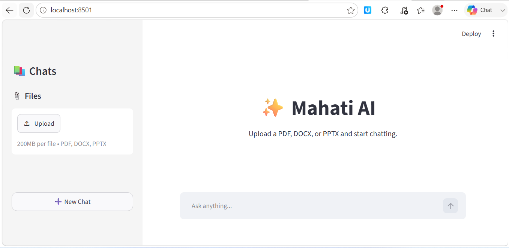

# AI Document Chatbot

An AI-powered chatbot built with Streamlit and Google Gemini that allows users to upload documents and chat with them.

## Features

* Chat with PDF files
* Chat with DOCX files
* Chat with PPTX files
* Multiple chat history support
* Chat titles based on uploaded file names
* Delete chats
* Streaming AI responses
* Typing/thinking indicator
* Secure API key management using `.env`

## Technologies Used

* Python
* Streamlit
* Google Gemini API
* PyPDF
* Python-Docx
* Python-PPTX

## Installation

1. Clone the repository

```bash
git clone https://github.com/Mahatibadhe05/chatbot-pdf.git
cd chatbot-pdf
```

2. Create a virtual environment

```bash
python -m venv .venv
```

3. Activate the virtual environment

Windows:

```bash
.venv\Scripts\activate
```

4. Install dependencies

```bash
pip install -r requirements.txt
```

5. Create a `.env` file

```env
GEMINI_API_KEY=your_api_key_here
```

6. Run the application

```bash
python -m streamlit run app.py
```

## Usage

1. Upload a PDF, DOCX, or PPTX file.
2. Ask questions about the uploaded document.
3. View and manage chat history from the sidebar.
4. Create new chats or delete old ones.

## Future Improvements

* Remember uploaded files per chat
* Dark mode UI
* Multiple document support
* Document citations
* Cloud deployment

## Author

Mahati Badhe
FY B.Tech Computer Science
KJ Somaiya Institute of Technology

## Screenshot


